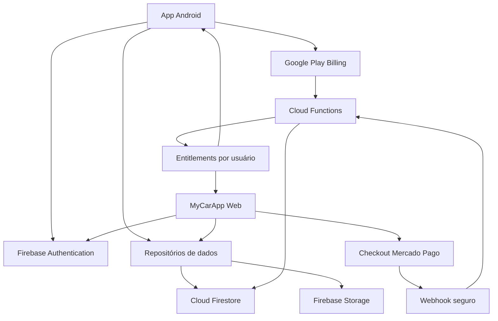

# Guia de implantação — MyCarApp Web e assinaturas

## 1. Objetivo

Disponibilizar o MyCarApp na Web para assinantes, mantendo o aplicativo Android, com dados sincronizados entre dispositivos e uma única regra de acesso Premium.

Proposta comercial inicial:

| Plano | Preço proposto | Renovação | Canais | Observação |
|---|---:|---|---|---|
| Gratuito | R$ 0 | — | Android | Recursos básicos e dados locais, conforme limites definidos pelo produto |
| Premium mensal | R$ 9,99 | Mensal | Android e Web | Sincronização, backup e recursos Premium |
| Premium anual | R$ 79,90 | Anual | Android e Web | Equivale a cerca de R$ 6,66/mês |
| Fundador Beta | R$ 99,00 | Pagamento único | Android e Web | Oferta individual para participantes elegíveis do teste Beta |

Texto recomendado para a oferta Fundador Beta:

> Pagamento único com acesso permanente ao MyCarApp enquanto o serviço estiver em operação, conforme os Termos de Uso.

Não usar a expressão “vitalício” isoladamente. O plano deve ser chamado de **Plano Fundador Beta** e não deve ser disponibilizado publicamente pelo mesmo valor.

## 2. Decisões que precisam ser confirmadas

Antes de iniciar a cobrança em produção, confirmar:

- preço anual de R$ 79,90;
- Mercado Pago como provedor inicial de pagamento da Web;
- prazo da oferta Fundador Beta, recomendado em 30 dias após o lançamento;
- data de corte e relação definitiva dos participantes elegíveis;
- domínio da versão Web;
- recursos e limites do plano gratuito;
- se recursos futuros de alto custo, como IA ou serviços de terceiros, poderão ser cobrados separadamente mesmo para Fundadores.

O desenvolvimento da base técnica pode começar antes dessas decisões, mas produtos e preços não devem ser publicados até a confirmação.

## 3. Estado atual e impacto técnico

O projeto já possui Firebase Authentication, Firestore e Cloud Functions. Também já existe verificação de assinatura do Google Play e uma coleção central de direitos de acesso.

Entretanto, os principais dados do veículo são gravados hoje em arquivos JSON locais. A versão Web não pode usar diretamente essa implementação porque depende de `dart:io` e `path_provider`. Também existem pacotes com suporte limitado à Web:

- `path_provider`: não oferece armazenamento de arquivos equivalente na Web;
- `google_mlkit_text_recognition`: suporta Android e iOS, não navegadores;
- `in_app_purchase`: será usado no Android, enquanto a Web precisará de checkout próprio;
- abertura de arquivos, anexos e notificações precisam de adaptações específicas por plataforma;
- a inicialização do Firebase precisa receber a configuração Web gerada pelo FlutterFire;
- Crashlytics e App Check devem ser inicializados de forma compatível com cada plataforma.

Conclusão: a versão Web não deve ser apenas “compilada”. Primeiro, é necessário separar o armazenamento da interface e implantar a camada de dados na nuvem.

## 4. Arquitetura proposta



Princípio principal: **o cliente nunca concede acesso Premium a si mesmo**. Android e Web apenas consultam o direito registrado pelo servidor.

## 5. Ambientes

Não desenvolver pagamentos diretamente no projeto de produção atual (`myappcar-cd4ec`). Criar três ambientes:

| Ambiente | Uso |
|---|---|
| Desenvolvimento | Emuladores, implementação diária e dados descartáveis |
| Homologação | Testes integrados com Mercado Pago e contas de licença do Google Play |
| Produção | Usuários e cobranças reais |

Cada ambiente deve possuir:

- projeto Firebase próprio;
- credenciais próprias do Mercado Pago;
- configuração Web própria;
- domínio ou subdomínio próprio;
- segredos armazenados no Secret Manager, nunca no aplicativo ou no repositório.

## 6. Modelo de dados sugerido

### 6.1 Dados pertencentes ao usuário

Usar subcoleções sob o usuário para facilitar regras e exclusão da conta:

```text
users/{uid}
users/{uid}/vehicles/{vehicleId}
users/{uid}/fuelings/{fuelingId}
users/{uid}/expenses/{expenseId}
users/{uid}/maintenances/{maintenanceId}
users/{uid}/documents/{documentId}
users/{uid}/notifications/{notificationId}
users/{uid}/journeys/{journeyId}
```

Cada registro deve conter pelo menos:

```text
id
ownerUid
createdAt
updatedAt
deletedAt (opcional, para exclusão sincronizada)
schemaVersion
```

Anexos devem ficar no Firebase Storage:

```text
users/{uid}/vehicles/{vehicleId}/attachments/{attachmentId}/{fileName}
```

O Firestore guarda somente os metadados e o caminho do arquivo.

### 6.2 Direito de acesso

Manter uma fonte única e protegida:

```text
entitlements/{uid}
```

Campos sugeridos:

```json
{
  "status": "active",
  "accessType": "subscription",
  "planId": "premium_monthly",
  "source": "google_play",
  "startsAt": "server timestamp",
  "expiresAt": "provider expiration or null",
  "autoRenewing": true,
  "providerReference": "protected reference",
  "updatedAt": "server timestamp"
}
```

Valores recomendados:

- `status`: `active`, `grace_period`, `past_due`, `expired`, `refunded`, `revoked`;
- `accessType`: `subscription`, `founder`, `manual`;
- `source`: `google_play`, `mercado_pago`, `admin`;
- `planId`: `premium_monthly`, `premium_annual`, `founder_beta`.

Somente Cloud Functions ou rotinas administrativas autorizadas podem alterar essa coleção.

### 6.3 Cobrança e idempotência

```text
billingEvents/{providerEventId}
orders/{orderId}
promotionClaims/{uid}
migrations/{uid}
```

`billingEvents` impede que o mesmo webhook conceda acesso mais de uma vez. `orders` registra o pedido sem armazenar dados completos do cartão. `promotionClaims` registra a utilização da oferta Beta. `migrations` registra o andamento da primeira sincronização.

## 7. Segurança

### 7.1 Firestore

As regras devem garantir que:

- o usuário só leia e altere documentos sob seu próprio `uid`;
- `ownerUid` seja igual ao usuário autenticado e não possa ser trocado;
- `entitlements`, `billingEvents`, `orders` e concessões de promoção sejam somente leitura para o cliente, quando a leitura for necessária;
- nenhuma coleção desconhecida fique aberta por padrão;
- consultas respeitem a mesma propriedade usada pelas regras.

Exemplo conceitual:

```javascript
match /users/{userId}/{collection}/{documentId} {
  allow read: if request.auth != null && request.auth.uid == userId;
  allow create: if request.auth != null
                && request.auth.uid == userId
                && request.resource.data.ownerUid == userId;
  allow update: if request.auth != null
                && request.auth.uid == userId
                && resource.data.ownerUid == userId
                && request.resource.data.ownerUid == userId;
  allow delete: if request.auth != null && request.auth.uid == userId;
}

match /entitlements/{userId} {
  allow read: if request.auth != null && request.auth.uid == userId;
  allow write: if false;
}
```

O exemplo deve ser adaptado e coberto por testes no Emulator Suite antes da publicação.

### 7.2 Storage

Aplicar a mesma propriedade por `uid`, limitar tamanho e tipos permitidos e rejeitar executáveis. Para comprovantes e documentos, definir explicitamente formatos aceitos, por exemplo JPEG, PNG e PDF.

### 7.3 Funções e segredos

- validar autenticação em todas as funções chamadas pelo aplicativo;
- validar App Check em funções sensíveis;
- nunca confiar em preço, plano, e-mail ou `uid` enviados livremente pelo cliente;
- usar valores do servidor e consultar o provedor de pagamento antes de liberar acesso;
- validar a assinatura dos webhooks;
- armazenar tokens do Mercado Pago e credenciais externas em segredos gerenciados;
- registrar ações administrativas em log de auditoria.

## 8. Refatoração do aplicativo

### 8.1 Criar contratos de repositório

Separar a interface das implementações de persistência:

```dart
abstract interface class VehicleRepository {
  Stream<List<Vehicle>> watchAll();
  Future<Vehicle?> getById(String id);
  Future<void> save(Vehicle vehicle);
  Future<void> delete(String id);
}
```

Criar contratos equivalentes para abastecimentos, despesas, manutenções, documentos, anexos e notificações.

Implementações:

```text
LocalVehicleRepository     -> arquivos locais do Android
CloudVehicleRepository     -> Firestore, Android Premium e Web
```

Usar importações condicionais e `kIsWeb` apenas na composição da aplicação. As telas não devem conhecer `dart:io`, arquivos locais ou detalhes do Firestore.

### 8.2 Estratégia recomendada de sincronização

Para a primeira versão:

- Web: nuvem obrigatória;
- Android gratuito: armazenamento local;
- Android Premium: nuvem como fonte principal, com cache local para leitura offline;
- alterações offline: fila local com identificador único;
- campos simples: vence a alteração com `updatedAt` mais recente do servidor;
- exclusões: usar `deletedAt` durante o período de sincronização, evitando o reaparecimento de registros;
- anexos: enviar separadamente e concluir o documento somente após sucesso do upload.

Essa solução é mais previsível do que tentar sincronizar dois bancos independentes em ambas as direções continuamente.

## 9. Migração dos dados locais

O Android existente precisa transportar os dados do usuário para a nuvem sem risco de perda.

Fluxo recomendado:

1. Solicitar login antes de ativar a sincronização.
2. Detectar se há dados locais ainda não migrados.
3. Mostrar resumo: veículos, abastecimentos, despesas, manutenções e documentos.
4. Pedir confirmação para “Sincronizar com a nuvem”.
5. Criar `migrations/{uid}` com identificador e estado `started`.
6. Enviar documentos em lotes idempotentes, preservando os IDs locais.
7. Enviar anexos e validar quantidades e checksums possíveis.
8. Marcar a migração como `completed` somente depois da conferência.
9. Manter uma cópia local de segurança; não apagar automaticamente os arquivos antigos.
10. Permitir “Tentar novamente” sem duplicar registros.

Casos que exigem tratamento explícito:

- usuário já possui dados na nuvem;
- dois aparelhos tentam migrar a mesma conta;
- conexão cai durante o envio;
- anexo é maior que o limite;
- usuário troca de conta durante a migração;
- um registro local está inválido ou pertence a uma versão antiga do modelo.

## 10. Adaptação para Flutter Web

### 10.1 Base da plataforma

Depois de criar uma branch de implementação e preservar o estado atual:

```powershell
flutter create --platforms=web .
flutterfire configure --project <projeto-homologacao> --platforms android,web
```

Usar as opções geradas por `flutterfire configure` na inicialização do Firebase.

### 10.2 Dependências e recursos

| Recurso atual | Tratamento para Web |
|---|---|
| Arquivos JSON locais | Substituir por repositórios Firestore |
| `dart:io` | Isolar com implementação condicional |
| `path_provider` | Não usar na implementação Web |
| OCR do ML Kit | Desabilitar no MVP Web ou implantar alternativa compatível depois |
| Compra no app | Google Play no Android; Mercado Pago na Web |
| Google Sign-In | Usar fluxo Firebase Auth compatível com navegador |
| Crashlytics | Inicializar somente em plataformas suportadas |
| App Check | Android com Play Integrity; Web com reCAPTCHA Enterprise ou opção suportada |
| Abrir anexos | Usar URL temporária/autorizada e APIs do navegador |
| Notificações locais | Não bloquear o MVP; avaliar notificações Web em fase posterior |

### 10.3 Interface responsiva

Manter a identidade visual atual e definir três faixas:

- celular: navegação inferior;
- tablet: conteúdo com largura controlada e navegação adaptada;
- desktop: menu lateral, área principal e melhor uso de tabelas/gráficos.

Não ampliar simplesmente a tela móvel. No desktop, aproveitar largura para filtros, histórico e comparações sem comprometer o uso no celular.

### 10.4 Recurso de Percurso

O recurso de Percurso permite registrar ou programar um deslocamento, acompanhar seu estado e encerrá-lo rapidamente pelo aplicativo ou por uma notificação aberta no Android.

#### Dados do percurso

Cada percurso deve permitir:

- selecionar o veículo;
- informar de onde o usuário saiu;
- informar para onde vai;
- definir data e hora de saída;
- informar ou calcular a distância aproximada;
- adicionar observação opcional;
- criar um lembrete na agenda;
- iniciar, marcar “Cheguei”, encerrar ou cancelar o percurso;
- consultar o histórico de percursos.

Modelo sugerido:

```json
{
  "id": "journeyId",
  "ownerUid": "uid",
  "vehicleId": "vehicleId",
  "origin": {
    "label": "Casa",
    "address": "endereço informado",
    "latitude": null,
    "longitude": null
  },
  "destination": {
    "label": "Trabalho",
    "address": "endereço informado",
    "latitude": null,
    "longitude": null
  },
  "scheduledAt": "timestamp",
  "startedAt": null,
  "arrivedAt": null,
  "endedAt": null,
  "approximateDistanceKm": 18.4,
  "distanceSource": "route_estimate",
  "status": "scheduled",
  "calendarReminderEnabled": true,
  "calendarEventId": null,
  "reminderMinutesBefore": 15,
  "notes": null,
  "createdAt": "server timestamp",
  "updatedAt": "server timestamp",
  "schemaVersion": 1
}
```

Estados permitidos:

```text
scheduled -> in_progress -> arrived -> completed
scheduled -> cancelled
in_progress -> completed
in_progress -> cancelled
```

`arrived` pode ser um estado curto, usado quando o usuário toca em “Cheguei”. A ação deve registrar `arrivedAt` e, conforme a decisão de produto, encerrar imediatamente o percurso ou manter a opção “Encerrar” para o usuário confirmar dados finais.

#### Distância aproximada

Para o MVP, não é necessário rastrear continuamente a localização. A distância pode vir de:

- estimativa de rota fornecida por um serviço de mapas;
- distância digitada pelo usuário;
- diferença entre hodômetro inicial e final, quando informados.

Registrar a origem do valor em `distanceSource`, por exemplo `route_estimate`, `manual` ou `odometer`. Se for usado um serviço de mapas, a chave deve ter restrições de domínio/aplicativo, orçamento e cotas configuradas.

Rastreamento contínuo por GPS deve ser tratado como uma fase futura. Ele aumenta consumo de bateria, custo, obrigações de privacidade e exigências de permissão de localização em segundo plano.

#### Agenda e lembrete

Ao ativar “Deixar lembrete na agenda”:

1. solicitar autorização de calendário somente no momento da ação;
2. criar um evento com origem, destino, veículo e horário;
3. adicionar lembrete com antecedência configurável, inicialmente 15 minutos;
4. guardar apenas o identificador necessário para atualizar ou cancelar o evento;
5. se a permissão for negada, oferecer lembrete interno e opção de exportar um arquivo `.ics`;
6. ao alterar ou cancelar o percurso, perguntar se o evento da agenda também deve ser atualizado.

O MyCarApp não deve ler toda a agenda do usuário quando apenas precisa criar ou atualizar seu próprio evento. Na Web, usar arquivo `.ics` ou integração explícita com o provedor de calendário; o navegador não oferece a mesma integração nativa do Android.

#### Notificação aberta durante o percurso

Quando o percurso passar para `in_progress`, o Android deve exibir uma notificação persistente com:

- origem e destino resumidos;
- horário de início;
- ação **Cheguei**;
- ação **Encerrar**;
- toque no corpo da notificação para abrir a tela do percurso.

Regras de comportamento:

- a notificação permanece visível enquanto houver percurso ativo;
- apenas um percurso pode estar ativo por usuário/veículo, conforme regra final do produto;
- “Cheguei” registra `arrivedAt` de forma idempotente;
- “Encerrar” solicita confirmação quando o app estiver aberto ou aplica a regra segura definida para a ação direta;
- depois de concluído ou cancelado, a notificação deve ser removida;
- se o aparelho reiniciar, o aplicativo deve restaurar a notificação de um percurso ainda ativo;
- ações recebidas offline entram na fila e sincronizam quando a conexão voltar;
- nenhuma ação pode alterar percurso pertencente a outra conta.

Se a implementação usar somente cronômetro e ações, evitar serviço de localização. Se no futuro houver rastreamento contínuo, será necessário serviço em primeiro plano, notificação específica, justificativa de permissão e revisão das políticas do Google Play.

Navegadores não garantem uma notificação persistente equivalente. Na Web, manter um indicador destacado de “Percurso em andamento” dentro da interface e usar notificações Web apenas como complemento quando houver permissão e suporte.

#### Regras funcionais

- exigir autenticação para sincronização e uso na Web;
- permitir salvar um percurso programado sem endereço geocodificado;
- impedir `scheduledAt` inválido e distância negativa;
- usar horário em UTC no banco e exibir no fuso local do usuário;
- registrar alterações importantes para recuperação e suporte;
- permitir que o usuário corrija distância, horários e observações após encerrar, mantendo `updatedAt`;
- um percurso concluído pode alimentar relatórios futuros de quilometragem e custo por distância;
- o recurso deve funcionar sem acesso Premium no nível definido pela estratégia comercial, mas sincronização Web e entre dispositivos continua sendo um benefício Premium.

#### Implementação técnica

Criar:

```text
JourneyRepository
LocalJourneyRepository
CloudJourneyRepository
JourneyReminderService
JourneyNotificationService
CalendarIntegrationService
DistanceEstimateService
```

As integrações de agenda, notificação e mapas devem ficar atrás de interfaces. Dessa forma, Android e Web podem ter comportamentos adequados sem espalhar verificações de plataforma pelas telas.

#### Privacidade do Percurso

Origem, destino, data, hora e coordenadas podem revelar hábitos sensíveis. Portanto:

- coletar coordenadas apenas com consentimento e quando necessárias;
- explicar o uso da localização antes de solicitar a permissão;
- não compartilhar percursos com anunciantes;
- incluir percursos na exportação e exclusão da conta;
- permitir apagar um percurso individualmente;
- não manter histórico de localização bruta se apenas a distância aproximada for necessária;
- proteger endereços e coordenadas pelas mesmas regras de propriedade do restante dos dados.

## 11. Cobrança no Android

Manter o Google Play Billing para compras iniciadas dentro do aplicativo Android.

Produtos sugeridos:

```text
premium_monthly
premium_annual
```

Etapas:

1. Configurar os produtos e planos-base no Play Console.
2. Aplicativo recebe o token da compra.
3. Aplicativo envia o token para uma Cloud Function autenticada.
4. Função consulta a Google Play Developer API.
5. Somente após a validação, a função atualiza `entitlements/{uid}`.
6. Real-time Developer Notifications atualizam renovações, cancelamentos, reembolsos e expirações.
7. O aplicativo oferece “Restaurar compra” e atualiza o acesso a partir do servidor.

A função existente de verificação é uma boa base, mas deve passar a registrar o plano canônico, origem, expiração, renovação e eventos idempotentes.

## 12. Cobrança na Web

Recomendação inicial: Mercado Pago, com checkout criado exclusivamente pelo backend.

### 12.1 Assinaturas

Fluxo:

1. Usuário autenticado escolhe mensal ou anual.
2. Web chama `createWebSubscriptionCheckout`.
3. A função obtém o preço e o plano em configuração segura; não aceita preço do navegador.
4. A função cria o pedido com `external_reference` contendo um `orderId` ligado ao `uid`.
5. Usuário conclui o pagamento no checkout.
6. Mercado Pago envia webhook.
7. Backend valida a assinatura do webhook e consulta a API do Mercado Pago.
8. Backend grava o evento idempotente e atualiza o entitlement.
9. A página acompanha `orders/{orderId}` e mostra a confirmação.

### 12.2 Plano Fundador Beta

O Fundador é pagamento único, não assinatura recorrente. Usar um fluxo de pagamento avulso e conceder:

```json
{
  "status": "active",
  "accessType": "founder",
  "planId": "founder_beta",
  "source": "mercado_pago",
  "expiresAt": null
}
```

A concessão só ocorre depois da confirmação definitiva do provedor. Reembolsos e contestações devem revogar ou suspender o acesso conforme os Termos de Uso.

### 12.3 Regra do Google Play

Por padrão, não colocar no aplicativo Android botão, link ou mensagem que direcione o usuário para pagar no site. Compras iniciadas no app devem seguir o Google Play Billing, salvo participação formal em programa aplicável do Google Play.

É possível divulgar o site por WhatsApp, e-mail e outros canais externos. Um usuário que comprou no site pode entrar com a mesma conta e consumir o acesso no Android, pois o entitlement é compartilhado.

Antes do lançamento, revisar novamente a política vigente do Google Play e os programas disponíveis no Brasil.

## 13. Oferta para participantes do Beta

### 13.1 Elegibilidade

Congelar a lista de elegíveis em uma data definida. O critério recomendado é:

- conta autenticada que participou do teste fechado até a data de corte;
- perfil marcado no servidor com `testerEligible: true`;
- código individual existente no app associado ao mesmo `uid`.

Não aceitar somente a posse do texto do código. Se um código for compartilhado, ele não deve funcionar em outra conta.

### 13.2 Resgate

Criar uma função `claimFounderBetaOffer`:

1. exige usuário autenticado e App Check válido;
2. recebe o código mostrado no aplicativo;
3. compara o hash do código com o perfil do próprio usuário;
4. confirma `testerEligible: true`;
5. confirma que a oferta está no prazo;
6. confirma que a conta ainda não resgatou a promoção;
7. cria transação ou pedido de R$ 99;
8. registra a reserva de resgate por prazo curto;
9. webhook confirma o pagamento e conclui `promotionClaims/{uid}`;
10. backend concede `founder_beta`.

Regras recomendadas:

- um resgate por conta e por código;
- código intransferível;
- preço e prazo definidos no servidor;
- reserva expira se o pagamento não for concluído;
- nenhuma tela cliente escreve diretamente a elegibilidade;
- atendimento pode corrigir exceções somente por operação auditada.

O código de indicação e o benefício Fundador podem ter a mesma aparência para o usuário, mas devem possuir regras e registros separados no backend.

## 14. Firebase Hosting e domínio

Adicionar o Hosting ao `firebase.json` e configurar a pasta de saída do Flutter Web:

```json
{
  "hosting": {
    "public": "build/web",
    "ignore": ["firebase.json", "**/.*", "**/node_modules/**"],
    "rewrites": [{ "source": "**", "destination": "/index.html" }]
  }
}
```

Fluxo de publicação:

```powershell
flutter build web --release
firebase hosting:channel:deploy homologacao
firebase deploy --only hosting
```

Antes da produção:

- conectar domínio próprio;
- confirmar HTTPS;
- configurar domínios autorizados do Firebase Auth;
- validar retorno do checkout;
- configurar cabeçalhos de segurança e política de conteúdo;
- garantir que arquivos com configuração sensível não façam parte do build;
- testar atualização do service worker e invalidação de cache.

## 15. Privacidade, LGPD e documentos legais

Atualizar a Política de Privacidade e os Termos de Uso antes da cobrança. Eles devem explicar:

- quais dados de veículos e usuários são armazenados;
- finalidade da sincronização e backup;
- operadores utilizados, como Firebase, Google Play e Mercado Pago;
- retenção, exportação e exclusão de dados;
- tratamento de documentos e anexos;
- funcionamento da renovação e do cancelamento;
- significado de acesso Fundador enquanto o serviço estiver disponível;
- regras de reembolso e contestação;
- eventual exclusão de serviços futuros de alto custo da licença Fundador.

Não armazenar dados de cartão. Implementar exclusão da conta e seus dados, observando a retenção mínima obrigatória de registros financeiros.

## 16. Observabilidade e suporte

Criar painéis e alertas para:

- falhas de webhook;
- pagamentos aprovados sem entitlement;
- entitlement ativo sem pedido válido;
- erros de migração;
- falhas de upload de anexos;
- tempo de resposta e erros das Cloud Functions;
- taxa de conversão mensal, anual e Fundador;
- cancelamentos, reembolsos e inadimplência.

Logs não devem conter tokens de compra, segredos, documentos pessoais ou payloads completos de pagamento.

## 17. Plano de execução

### Fase 0 — Preparação e decisões

- [ ] Confirmar planos, preços, prazo Fundador e termos comerciais.
- [ ] Definir a lista e a data de corte dos participantes Beta.
- [ ] Criar ambientes Firebase de desenvolvimento e homologação.
- [ ] Criar conta/aplicação de teste no Mercado Pago.
- [ ] Definir domínio e e-mail de suporte.
- [ ] Criar flags remotas: `cloudSyncEnabled`, `webEnabled`, `webCheckoutEnabled`, `founderOfferEnabled`.

Critério de saída: decisões registradas e ambientes isolados disponíveis.

### Fase 1 — Backend e segurança

- [ ] Definir schema final e índices do Firestore.
- [ ] Implementar regras do Firestore e Storage.
- [ ] Criar testes das regras no Emulator Suite.
- [ ] Padronizar `entitlements/{uid}`.
- [ ] Criar `orders`, `billingEvents`, `promotionClaims` e `migrations`.
- [ ] Implantar logs de auditoria e idempotência.
- [ ] Configurar segredos e App Check.

Critério de saída: nenhum cliente consegue conceder Premium, ler dados alheios ou reutilizar eventos.

### Fase 2 — Repositórios e migração Android

- [ ] Criar interfaces de repositório.
- [ ] Adaptar as implementações locais existentes.
- [ ] Criar implementações Firestore.
- [ ] Criar repositórios local e em nuvem para Percursos.
- [ ] Implementar fila offline e política de conflito.
- [ ] Construir assistente de migração.
- [ ] Testar migração interrompida, repetida e com dados já existentes.
- [ ] Liberar para equipe interna por feature flag.

Critério de saída: uma conta de teste usa os mesmos dados em dois aparelhos sem perda ou duplicação.

### Fase 3 — Web MVP

- [ ] Gerar e configurar a plataforma Web.
- [ ] Tornar Firebase Auth compatível com navegador.
- [ ] Isolar recursos não suportados na Web.
- [ ] Adaptar navegação e telas principais para desktop.
- [ ] Implementar veículos, abastecimentos, despesas e manutenções.
- [ ] Implementar criação, programação, histórico e edição de Percursos.
- [ ] Implementar agenda e lembrete com alternativa `.ics` na Web.
- [ ] Implementar notificação Android aberta com “Cheguei” e “Encerrar”.
- [ ] Implementar documentos e anexos compatíveis.
- [ ] Publicar canal de preview no Firebase Hosting.

Critério de saída: usuário autenticado consulta e altera os mesmos dados no Android e na Web.

### Fase 4 — Assinaturas

- [ ] Cadastrar mensal e anual no Google Play.
- [ ] Consolidar validação e notificações do Google Play.
- [ ] Criar checkout de assinatura no Mercado Pago.
- [ ] Implementar e validar webhook.
- [ ] Sincronizar cancelamento, expiração, reembolso e período de tolerância.
- [ ] Criar telas “Minha assinatura” e “Restaurar compra”.
- [ ] Realizar reconciliação diária entre pedidos e entitlements.

Critério de saída: todos os estados de cobrança produzem o acesso esperado, inclusive eventos duplicados ou fora de ordem.

### Fase 5 — Fundador Beta

- [ ] Importar e congelar elegibilidade.
- [ ] Implementar resgate vinculado ao `uid`.
- [ ] Criar pagamento único de R$ 99.
- [ ] Implantar prazo e limite no servidor.
- [ ] Preparar mensagem externa por WhatsApp/e-mail.
- [ ] Testar código compartilhado, reutilizado, inválido e expirado.

Critério de saída: apenas um participante elegível consegue comprar uma única licença com o próprio código.

### Fase 6 — Homologação e lançamento gradual

- [ ] Concluir matriz de testes.
- [ ] Fazer teste interno com dados reais anonimizados.
- [ ] Liberar para pequeno grupo Beta.
- [ ] Monitorar erros e conciliar pagamentos diariamente.
- [ ] Publicar Termos e Política de Privacidade.
- [ ] Submeter versão Android atualizada ao Google Play.
- [ ] Abrir gradualmente o acesso Web.

Critério de saída: estabilidade, pagamentos conciliados e suporte preparado.

## 18. Matriz mínima de testes

| Cenário | Resultado esperado |
|---|---|
| Conta nova sem dados | Inicia vazia sem erro |
| Migração de dados locais | Quantidades e valores preservados |
| Migração interrompida | Retomada sem duplicação |
| Dois dispositivos editam um registro | Política de conflito aplicada |
| Android fica offline | Alteração entra na fila e sincroniza depois |
| Usuário tenta ler outro `uid` | Acesso negado |
| Assinatura mensal aprovada | Premium liberado pelo servidor |
| Pagamento pendente | Premium não liberado prematuramente |
| Assinatura cancelada com prazo restante | Acesso permanece até a expiração |
| Reembolso ou revogação | Entitlement atualizado corretamente |
| Webhook repetido | Nenhuma concessão duplicada |
| Eventos fora de ordem | Estado final permanece correto |
| Código Beta de outra pessoa | Resgate recusado |
| Código Beta já usado | Segundo resgate recusado |
| Fundador aprovado | Acesso sem expiração e com origem registrada |
| Logout e login em outra conta | Dados não vazam entre contas |
| Recarregar página Web | Rota e sessão continuam funcionando |
| Celular, tablet e desktop | Layout utilizável nas três faixas |
| Criar percurso programado | Origem, destino, data, hora e distância são preservados |
| Criar lembrete na agenda | Evento e antecedência são configurados corretamente |
| Permissão de agenda negada | Aplicativo oferece lembrete interno ou arquivo `.ics` |
| Iniciar percurso no Android | Notificação aberta exibe “Cheguei” e “Encerrar” |
| Tocar em “Cheguei” duas vezes | Horário é registrado uma vez, sem duplicação |
| Encerrar percurso offline | Ação é preservada e sincronizada posteriormente |
| Reiniciar durante percurso | Notificação do percurso ativo é restaurada |
| Percurso em andamento na Web | Indicador interno permanece visível após recarregar |
| Datas em fusos diferentes | Banco preserva UTC e interface exibe horário local correto |
| Tentativa de alterar percurso alheio | Acesso negado |

## 19. Implantação e rollback

### Ordem recomendada de implantação

1. regras, índices e coleções;
2. Cloud Functions compatíveis com a versão antiga do app;
3. nova versão Android com migração desligada;
4. ativação gradual de sincronização;
5. Web em canal de preview;
6. checkout em modo de teste;
7. Web de produção sem divulgação ampla;
8. ativação do checkout;
9. ativação da oferta Fundador;
10. divulgação aos participantes Beta.

### Rollback

Em caso de incidente:

- desligar imediatamente `webCheckoutEnabled` para impedir novas cobranças;
- desligar `founderOfferEnabled` sem apagar resgates existentes;
- manter entitlements já concedidos até análise, evitando bloquear clientes pagos por falha interna;
- voltar o Firebase Hosting para a versão estável anterior;
- desativar sincronização por flag, preservando dados locais e na nuvem;
- reprocessar webhooks a partir de `billingEvents` e da API oficial do provedor;
- comunicar usuários afetados quando houver impacto financeiro ou de disponibilidade.

Nunca corrigir um incidente apagando em massa pedidos, eventos ou dados migrados.

## 20. Estimativa inicial

Para uma pessoa com dedicação principal, uma primeira versão segura incluindo Percursos tende a exigir aproximadamente 7 a 10 semanas:

| Entrega | Estimativa |
|---|---:|
| Backend, schema e regras | 1–1,5 semana |
| Repositórios e migração Android | 1,5–2 semanas |
| Web responsiva e Percursos | 2–3 semanas |
| Google Play e Mercado Pago | 1–1,5 semana |
| Oferta Fundador, QA e lançamento | 1–2 semanas |

A estimativa total passa para aproximadamente **7 a 10 semanas** com o Percurso no MVP. Ela deve ser revisada depois de inventariar todas as telas, modelos e regras do app. Rastreamento GPS contínuo, OCR na Web, edição offline avançada e relatórios novos aumentam o prazo e podem ficar para uma segunda entrega.

## 21. Primeiro ciclo de trabalho recomendado

Começar pelas tarefas abaixo, nesta ordem:

1. registrar as decisões comerciais da seção 2;
2. criar o ambiente Firebase de homologação;
3. documentar o schema atual de cada arquivo local;
4. criar contratos dos repositórios sem alterar o comportamento das telas;
5. criar regras e testes para os dados por usuário;
6. padronizar o entitlement existente;
7. implementar migração de um único módulo, começando por veículos;
8. validar o mesmo veículo no Android e em uma tela Web mínima;
9. repetir para abastecimentos, despesas e manutenções;
10. implementar Percursos primeiro sem rastreamento contínuo de GPS;
11. validar agenda, notificação persistente e ações offline no Android;
12. somente então integrar os pagamentos.

Essa sequência reduz o risco: a cobrança entra depois que login, dados, segurança e acesso compartilhado já funcionam.

## 22. Critério de conclusão do projeto

O lançamento está pronto quando:

- Android e Web usam a mesma conta e exibem os mesmos dados;
- percursos sincronizam origem, destino, horários, estado e distância aproximada;
- agenda, lembrete e notificação de percurso possuem alternativas seguras por plataforma;
- “Cheguei” e “Encerrar” funcionam sem duplicação, inclusive após perda de conexão;
- dados locais existentes podem ser migrados sem perda;
- nenhuma regra permite acesso entre usuários;
- nenhum cliente consegue escrever seu próprio entitlement;
- mensal, anual, cancelamento, expiração e reembolso foram testados;
- a compra Fundador é limitada ao usuário Beta elegível;
- webhooks são autenticados e idempotentes;
- checkout pode ser desligado sem nova publicação;
- termos, privacidade, exclusão de conta e suporte estão publicados;
- existe monitoramento e procedimento de rollback;
- a equipe consegue reconciliar cada pagamento com seu pedido e entitlement.

## 23. Referências oficiais

- [Configuração do Firebase para Flutter](https://firebase.google.com/docs/flutter/setup)
- [Condições das regras de segurança do Firestore](https://firebase.google.com/docs/firestore/security/rules-conditions)
- [Planos de assinatura do Mercado Pago](https://www.mercadopago.com.br/developers/pt/docs/subscription-plans/overview)
- [API de assinaturas do Mercado Pago](https://www.mercadopago.com.br/developers/pt/reference/online-payments/subscriptions/overview)
- [Assinaturas associadas a um plano](https://www.mercadopago.com.br/developers/pt/docs/subscriptions/integration-configuration/subscription-associated-plan)
- [Webhooks do Mercado Pago](https://www.mercadopago.com.br/developers/pt/docs/subscriptions/additional-content/your-integrations/notifications/webhooks)
- [Política de pagamentos do Google Play](https://support.google.com/googleplay/android-developer/answer/10281818?hl=pt-BR)
- [Faturamento alternativo com escolha do usuário no Brasil](https://support.google.com/googleplay/android-developer/answer/13821247?hl=pt-BR)
- [Compatibilidade do path_provider](https://pub.dev/packages/path_provider)
- [Compatibilidade do Google ML Kit Text Recognition](https://pub.dev/packages/google_mlkit_text_recognition)
- [Compatibilidade do in_app_purchase](https://pub.dev/packages/in_app_purchase)
